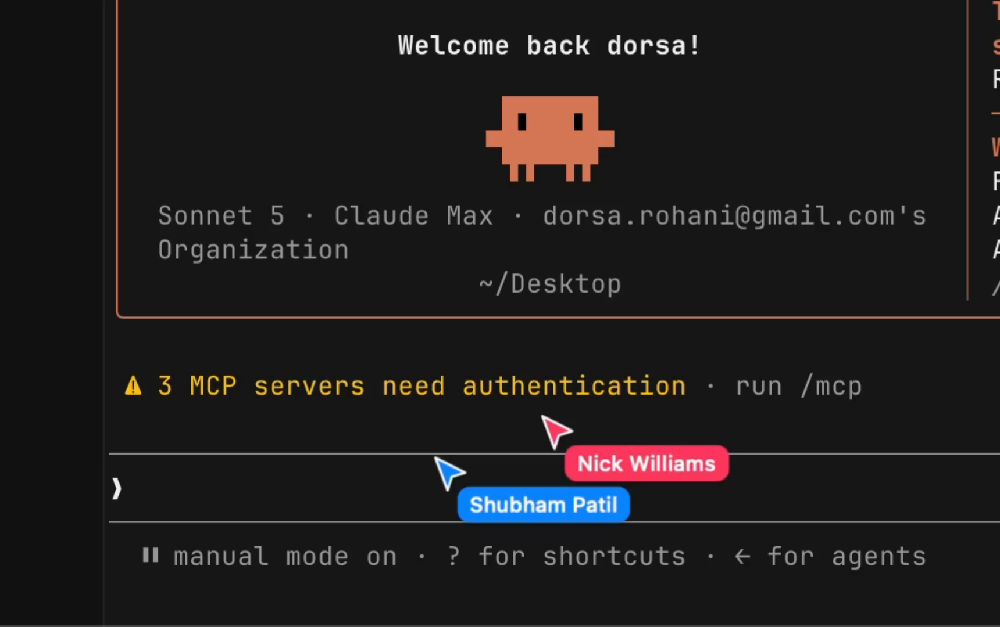

<h1 align="center">Mosaic</h1>

Multiplayer Claude Code — a native macOS terminal for solving the hardest problems together.

  

## What is Mosaic?

Mosaic is a native macOS terminal workspace built for collaborating with people and agents at the same time. Open a room, share your terminals, and let teammates jump into the same Claude Code and agent sessions live — everyone sees the same panes, output, and cursors in real time.

- **Real-time collaboration** — Share terminals and agent sessions in a room. Teammates connect, watch, and take over any pane without passing files or screenshots around.
- **Built for coding agents** — Runs Claude Code and any other terminal agent natively. Agents and teammates share the same surfaces, so a run is always visible and controllable.
- **Native macOS app** — Built with Swift and AppKit on [libghostty](https://github.com/ghostty-org/ghostty), not Electron. Fast startup, low memory, GPU-accelerated rendering.

## License

Mosaic is open source under [GPL-3.0-or-later](LICENSE).

If your organization cannot comply with GPL, a commercial license is available. Contact [contact@emergent.inc](mailto:contact@emergent.inc) for details.
